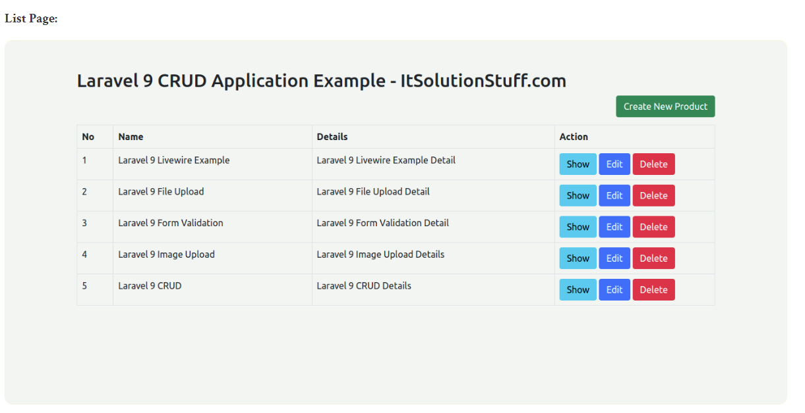
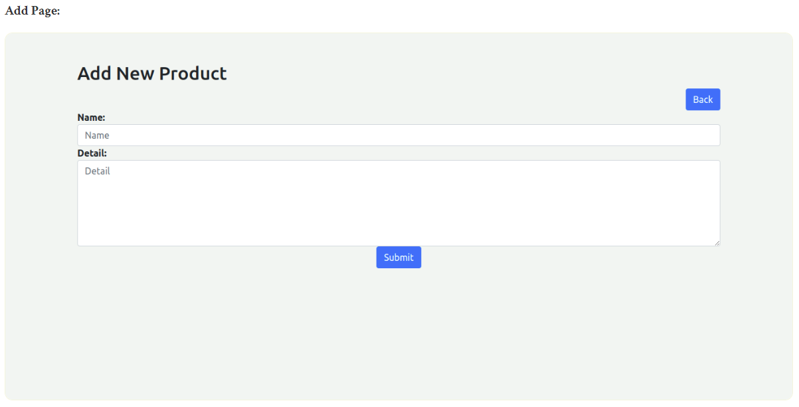
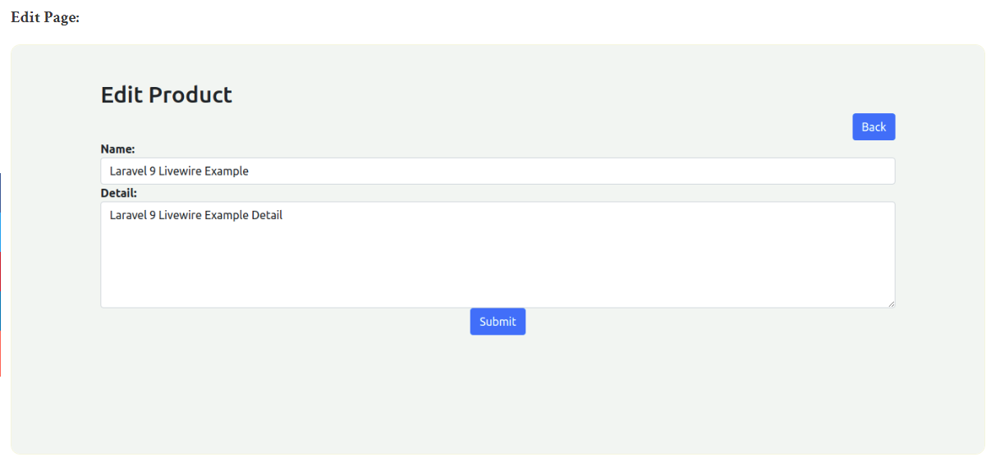
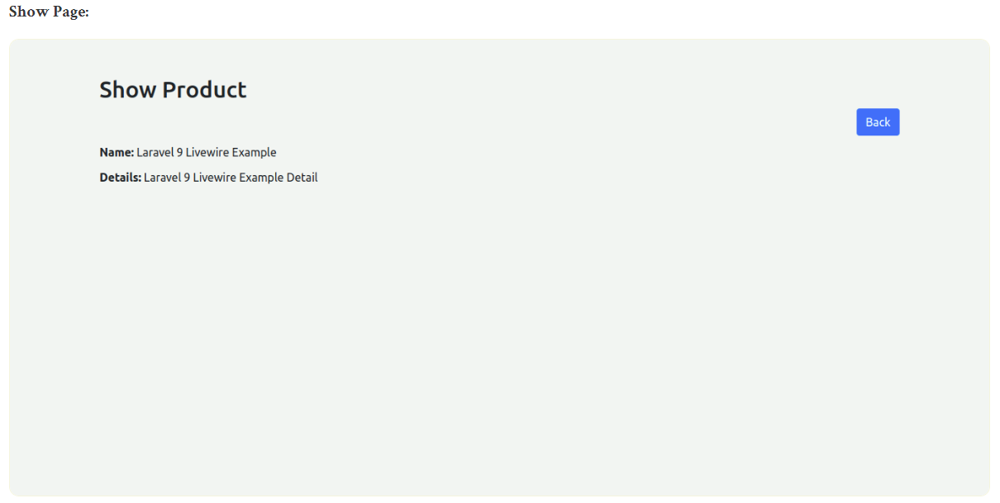

# Laravel9_CRUD_Application
## 1. Laravel 9 CRUD Application Tutorial Example
- Tạo mới một project laravel;

```Dockerfile
composer create-project laravel/laravel laravel9_crud_application
```
- Tạo một database tên: laravel9_crud_application 
## 2. Database Configuration
- thiết lập file .env

```Dockerfile
DB_CONNECTION=mysql
DB_HOST=127.0.0.1
DB_PORT=3306
DB_DATABASE=here your database name(blog)   Ví dụ như laravel9_crud_application
DB_USERNAME=here database username(root)    
DB_PASSWORD=here database password(root)
```

## 3.Create Migration
-  chạy lệnh 

```Dockerfile
php artisan make:migration create_products_table --create=products
```

- Chúng ta vào database/migrations thay đổi code để tạo bảng

```Dockerfile
<?php
  
use Illuminate\Database\Migrations\Migration;
use Illuminate\Database\Schema\Blueprint;
use Illuminate\Support\Facades\Schema;
  
return new class extends Migration
{
    /**
     * Run the migrations.
     *
     * @return void
     */
    public function up()
    {
        Schema::create('products', function (Blueprint $table) {
            $table->id();
            $table->string('name');
            $table->text('detail');
            $table->timestamps();
        });
    }
  
    /**
     * Reverse the migrations.
     *
     * @return void
     */
    public function down()
    {
        Schema::dropIfExists('products');
    }
};
```

- Chạy lệnh tạo bảng:

```Dockerfile
php artisan migrate
```
## 4.Create Controller and Model
- Chạy lệnh sau để tạo:

```Dockerfile
php artisan make:migration create_products_table --create=products
```

- Nó sẽ tạo ra một controlle như trên đường dẫn: app / Http / Controllers / ProductController.php

```Dockerfile
<? php
  
không gian tên App \ Http \ Controllers ; 
  
sử dụng Ứng dụng \ Mô hình \ Sản phẩm ; 
sử dụng Illuminate \ Http \ Request ; 
  
class ProductController mở rộng Bộ điều khiển   
{
    / **
     * Hiển thị danh sách tài nguyên.
     *
     * @return \ Illuminate \ Http \ Response
     * /
    chỉ số chức năng công khai () 
    {
        $ products = Sản phẩm :: mới nhất () -> paginate ( 5 ); 
      
        return view ( 'products.index' , compact ( 'products' ))
            -> with ( 'i' , ( request () -> input ( 'page' , 1 ) - 1 ) * 5 );      
    }
  
    / **
     * Hiển thị biểu mẫu để tạo một tài nguyên mới.
     *
     * @return \ Illuminate \ Http \ Response
     * /
    hàm public create () 
    {
        return view ( 'products.create' );
    }
  
    / **
     * Lưu trữ tài nguyên mới được tạo trong bộ nhớ.
     *
     * @param \ Illuminate \ Http \ Request $ request
     * @return \ Illuminate \ Http \ Response
     * /
    cửa hàng chức năng công cộng ( Yêu cầu $ request ) 
    {
        $ request -> xác thực ([
            'name' => 'bắt buộc' ,  
            'detail' => 'bắt buộc' ,  
        ]);
      
        Sản phẩm :: create ( $ request -> all ());
       
        return redirect () -> route ( 'products.index' )
                        -> with ( 'thành công' , 'Sản phẩm được tạo thành công.' );
    }
  
    / **
     * Hiển thị tài nguyên được chỉ định.
     *
     * @param \ App \ Models \ Product $ product
     * @return \ Illuminate \ Http \ Response
     * /
    hiển thị chức năng công khai ( Sản phẩm $ product ) 
    {
        return view ( 'products.show' , compact ( 'product' ));
    }
  
    / **
     * Hiển thị biểu mẫu để chỉnh sửa tài nguyên được chỉ định.
     *
     * @param \ App \ Models \ Product $ product
     * @return \ Illuminate \ Http \ Response
     * /
    chỉnh sửa chức năng công khai ( Sản phẩm $ product ) 
    {
        return view ( 'products.edit' , compact ( 'product' ));
    }
  
    / **
     * Cập nhật tài nguyên được chỉ định trong bộ nhớ.
     *
     * @param \ Illuminate \ Http \ Request $ request
     * @param \ App \ Models \ Product $ product
     * @return \ Illuminate \ Http \ Response
     * /
    cập nhật chức năng công khai ( Yêu cầu $ yêu cầu , Sản phẩm $ sản phẩm )  
    {
        $ request -> xác thực ([
            'name' => 'bắt buộc' ,  
            'detail' => 'bắt buộc' ,  
        ]);
      
        $ product -> update ( $ request -> all ());
      
        return redirect () -> route ( 'products.index' )
                        -> with ( 'thành công' , 'Sản phẩm được cập nhật thành công' );
    }
    / **
     * Xóa tài nguyên được chỉ định khỏi bộ nhớ.
     *
     * @param \ App \ Models \ Product $ product
     * @return \ Illuminate \ Http \ Response
     * /
    chức năng công khai phá hủy ( Sản phẩm $ sản phẩm ) 
    {
        $ product -> delete ();
       
        return redirect () -> route ( 'products.index' )
                        -> with ( 'thành công' , 'Sản phẩm đã xóa thành công' );
    }
}
```

- Ok, và khi chạy lệnh dưới đây, bạn sẽ tìm thấy "app / Models / Product.php" và nhập nội dung dưới đây vào tệp Product.php

```Dockerfile
<? php
  
không gian tên App \ Models ; 
  
sử dụng Illuminate \ Database \ Eloquent \ Factories \ HasFactory ; 
sử dụng Illuminate \ Database \ Eloquent \ Model ; 
  
lớp Sản phẩm mở rộng Mô hình   
{
    sử dụng HasFactory ; 
  
    được bảo vệ $ fillable = [ 
        'name' , 'detail' 
    ];
}
```
## 5. thêm Router
- Vào routes/web.php:

```Dockerfile
<?php
  
use Illuminate\Support\Facades\Route;
  
use App\Http\Controllers\ProductController;
  
/*
|--------------------------------------------------------------------------
| Web Routes
|--------------------------------------------------------------------------
|
| Here is where you can register web routes for your application. These
| routes are loaded by the RouteServiceProvider within a group that
| contains the "web" middleware group. Now create something great!
|
*/
  
Route::resource('products', ProductController::class);
```
## 6. Tạo các file Blade 

- layout.blade.php trong resources/views/products/layout.blade.php

```Dockerfile
<!DOCTYPE html>
<html>
<head>
    <title>Laravel 9 CRUD Application - ItSolutionStuff.com</title>
    <link href="https://cdn.jsdelivr.net/npm/bootstrap@5.0.2/dist/css/bootstrap.min.css" rel="stylesheet">
</head>
<body>
    
<div class="container">
    @yield('content')
</div>
    
</body>
</html>
```

- index.blade.php trong resources/views/products/index.blade.php

```Dockerfile
@extends('products.layout')
 
@section('content')
    <div class="row">
        <div class="col-lg-12 margin-tb">
            <div class="pull-left">
                <h2>Laravel 9 CRUD Example from scratch - ItSolutionStuff.com</h2>
            </div>
            <div class="pull-right">
                <a class="btn btn-success" href="{{ route('products.create') }}"> Create New Product</a>
            </div>
        </div>
    </div>
   
    @if ($message = Session::get('success'))
        <div class="alert alert-success">
            <p>{{ $message }}</p>
        </div>
    @endif
   
    <table class="table table-bordered">
        <tr>
            <th>No</th>
            <th>Name</th>
            <th>Details</th>
            <th width="280px">Action</th>
        </tr>
        @foreach ($products as $product)
        <tr>
            <td>{{ ++$i }}</td>
            <td>{{ $product->name }}</td>
            <td>{{ $product->detail }}</td>
            <td>
                <form action="{{ route('products.destroy',$product->id) }}" method="POST">
   
                    <a class="btn btn-info" href="{{ route('products.show',$product->id) }}">Show</a>
    
                    <a class="btn btn-primary" href="{{ route('products.edit',$product->id) }}">Edit</a>
   
                    @csrf
                    @method('DELETE')
      
                    <button type="submit" class="btn btn-danger">Delete</button>
                </form>
            </td>
        </tr>
        @endforeach
    </table>
  
    {!! $products->links() !!}
      
@endsection
```

- create.blade.php trong resources/views/products/create.blade.php

```Dockerfile
@extends('products.layout')
  
@section('content')
<div class="row">
    <div class="col-lg-12 margin-tb">
        <div class="pull-left">
            <h2>Add New Product</h2>
        </div>
        <div class="pull-right">
            <a class="btn btn-primary" href="{{ route('products.index') }}"> Back</a>
        </div>
    </div>
</div>
   
@if ($errors->any())
    <div class="alert alert-danger">
        <strong>Whoops!</strong> There were some problems with your input.<br><br>
        <ul>
            @foreach ($errors->all() as $error)
                <li>{{ $error }}</li>
            @endforeach
        </ul>
    </div>
@endif
   
<form action="{{ route('products.store') }}" method="POST">
    @csrf
  
     <div class="row">
        <div class="col-xs-12 col-sm-12 col-md-12">
            <div class="form-group">
                <strong>Name:</strong>
                <input type="text" name="name" class="form-control" placeholder="Name">
            </div>
        </div>
        <div class="col-xs-12 col-sm-12 col-md-12">
            <div class="form-group">
                <strong>Detail:</strong>
                <textarea class="form-control" style="height:150px" name="detail" placeholder="Detail"></textarea>
            </div>
        </div>
        <div class="col-xs-12 col-sm-12 col-md-12 text-center">
                <button type="submit" class="btn btn-primary">Submit</button>
        </div>
    </div>
   
</form>
@endsection
```

- edit.blade.php trong resources/views/products/edit.blade.php

```Dockerfile
@extends('products.layout')
   
@section('content')
    <div class="row">
        <div class="col-lg-12 margin-tb">
            <div class="pull-left">
                <h2>Edit Product</h2>
            </div>
            <div class="pull-right">
                <a class="btn btn-primary" href="{{ route('products.index') }}"> Back</a>
            </div>
        </div>
    </div>
   
    @if ($errors->any())
        <div class="alert alert-danger">
            <strong>Whoops!</strong> There were some problems with your input.<br><br>
            <ul>
                @foreach ($errors->all() as $error)
                    <li>{{ $error }}</li>
                @endforeach
            </ul>
        </div>
    @endif
  
    <form action="{{ route('products.update',$product->id) }}" method="POST">
        @csrf
        @method('PUT')
   
         <div class="row">
            <div class="col-xs-12 col-sm-12 col-md-12">
                <div class="form-group">
                    <strong>Name:</strong>
                    <input type="text" name="name" value="{{ $product->name }}" class="form-control" placeholder="Name">
                </div>
            </div>
            <div class="col-xs-12 col-sm-12 col-md-12">
                <div class="form-group">
                    <strong>Detail:</strong>
                    <textarea class="form-control" style="height:150px" name="detail" placeholder="Detail">{{ $product->detail }}</textarea>
                </div>
            </div>
            <div class="col-xs-12 col-sm-12 col-md-12 text-center">
              <button type="submit" class="btn btn-primary">Submit</button>
            </div>
        </div>
   
    </form>
@endsection
```

- show.blade.php trong resources/views/products/show.blade.php


```Dockerfile
@extends('products.layout')
  
@section('content')
    <div class="row">
        <div class="col-lg-12 margin-tb">
            <div class="pull-left">
                <h2> Show Product</h2>
            </div>
            <div class="pull-right">
                <a class="btn btn-primary" href="{{ route('products.index') }}"> Back</a>
            </div>
        </div>
    </div>
   
    <div class="row">
        <div class="col-xs-12 col-sm-12 col-md-12">
            <div class="form-group">
                <strong>Name:</strong>
                {{ $product->name }}
            </div>
        </div>
        <div class="col-xs-12 col-sm-12 col-md-12">
            <div class="form-group">
                <strong>Details:</strong>
                {{ $product->detail }}
            </div>
        </div>
    </div>
@endsection
```
## 7. Chạy project

```Dockerfile
php artisan serve
```
-  Vào 
http://localhost:8000/products








